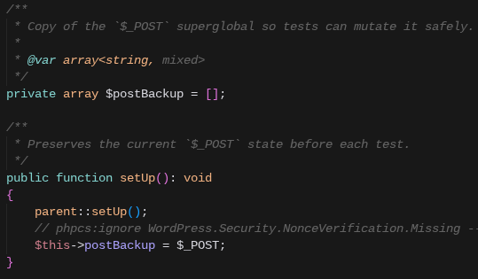
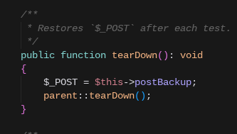
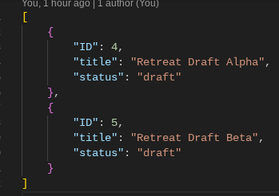
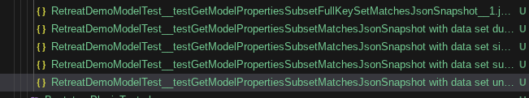
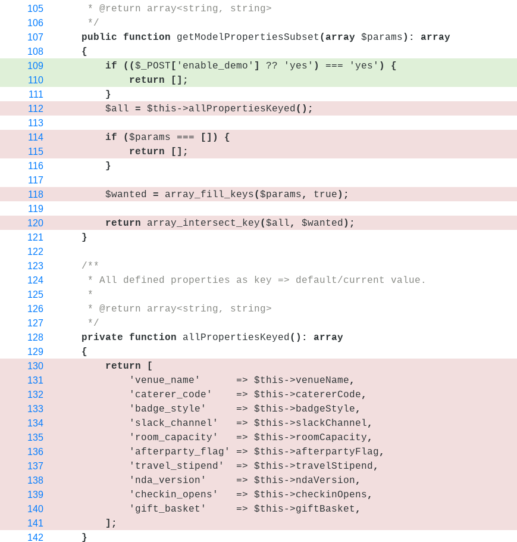

# Cursor + PHPUnit: turning weak first drafts into real unit tests

---

## What's the hardest thing for a developer?

* Convincing people that the bug they found is actually a feature!
* But we're not here for that…

---

## What's the most boring thing for a developer?

* Yes, writing tests! Sorry, Monika.

---

## Yet they matter — we can't ignore them.

* So why not delegate as much of this as we can to a smart assistant, without giving up quality?

---

Over the past few months I've used AI to write unit tests for me:

* Overall it did a solid job.
* The longer I used it, the more the same quirks kept showing up.

---

What I saw led me to pick this topic for Tips & Tricks, and to:

* Build a very small codebase that mimics real codebases I've worked on.
<!-- Presenter: at a manageable scale, real codebases I've worked on — so those same quirks show up in a controlled slice of code. -->
* Let AI create tests with a simple prompt and observe the results.
* Turn my takeaways into project rules for test writing.
* Let AI create tests again, and compare the results.

---

## Let AI create tests with a simple prompt:

Here's the simple prompt I gave Cursor's Agent (Composer 2 Fast):

> create tests for code @cspf-retreat-2026-code/inc with the following constraints:
> - test coverage should be greater than 90%.
> - use snapshots and data providers where they fit best (e.g. when comparing arrays, structured data in general, or HTML).

---

## What it did:

* It generated a lot of tests :).
* It missed the coverage target — about **81%** lines, **86.5%** functions and methods.
* It still hit most of the quirks I'd expected (maybe the smaller codebase meant it stumbled a little less).

---

## Quirks Example 1/3:

It doesn't seem to be completely aware of the test framework we're in.

* `$method = $this->getMethod(PostPublishedAgeService::class, 'computeDayDifference')` would have been enough.

  <ul class="plain-sub"><li>

  

  </li></ul>

<!-- Presenter: Our base test class uses a trait that already handles reflection for private/protected calls, and avoids the deprecated APIs for our PHPUnit version. -->

---

## Quirks Example 1/3 (continued):

* Redundant code.

  <ul class="plain-sub"><li>

  

  

  

  

  </li></ul>

<!-- Presenter: Our base class extends WordPress's base test case, which already resets (“flushes”) superglobals before each test — so manual backup/restore is redundant. -->

---

## Quirks Example 2/3:

Some problems with dynamic data.

* Hard-coded post IDs in snapshots.

<!-- Presenter: That's wrong because it assumes the "fake" posts we create for testing will always have those IDs — but post IDs are incremental, and for several reasons we can't rely on that. What if we run that specific test in isolation? -->

---

## Quirks Example 3/3:

Snapshots can match expectations while the test is still useless.

<!-- Presenter: The AI never pinned down the condition needed to get a meaningful result from the method — here, a specific `$_POST` value. The tests stay green, but we never exercised the real logic; code coverage shows that clearly. -->

---

## Clearer instructions for the AI:

* I removed the old tests and **turned the takeaways into a Cursor project rule** under `.cursor/rules/` — summarizing the same issues as in the examples above.
* Then I ran this prompt:

  <ul class="plain-sub"><li><blockquote>create tests for code in @cspf-retreat-2026-code/inc, test coverage should be greater than 90%.</blockquote></li></ul>

---

### Result:

* Pros:
  * Fewer meaningless tests (no more “green but useless” cases).
  * Dynamic data handled with normalized snapshots.
  * Fewer snapshots where a simple assertion was enough.
  * Less redundant boilerplate from misunderstanding the test stack.
  * Coverage: **86.97%** lines, **91.9%** functions and methods.
  * Less frustration :D.

* Cons:
  * Longer runs — more meaningful tests and more `@runInSeparateProcess` cases; that's mostly extra volume, not a downside of the rules themselves.

---

## Final considerations:

* Use AI to write or polish tests — it saves a lot of time and friction.
* Don't trust the output blindly: review what it generates (including meaningless “green” tests).
* Don't let the model **silently edit production code** just to make tests pass; if a refactor is warranted, have it **propose** the change — you apply it once you agree.
* If the agent keeps failing tests in a loop, look at the **code under test**, not only the tests.
* Have it work in **small slices** of the codebase at a time — easier to review and to catch bad assumptions early.
* If you wish, treat my **Cursor project rule** as a starting point and adapt it to your project.

---

## Thank you

Questions?